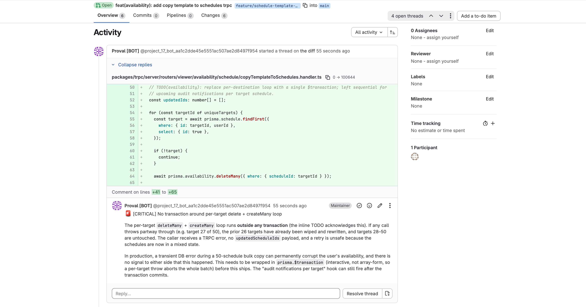
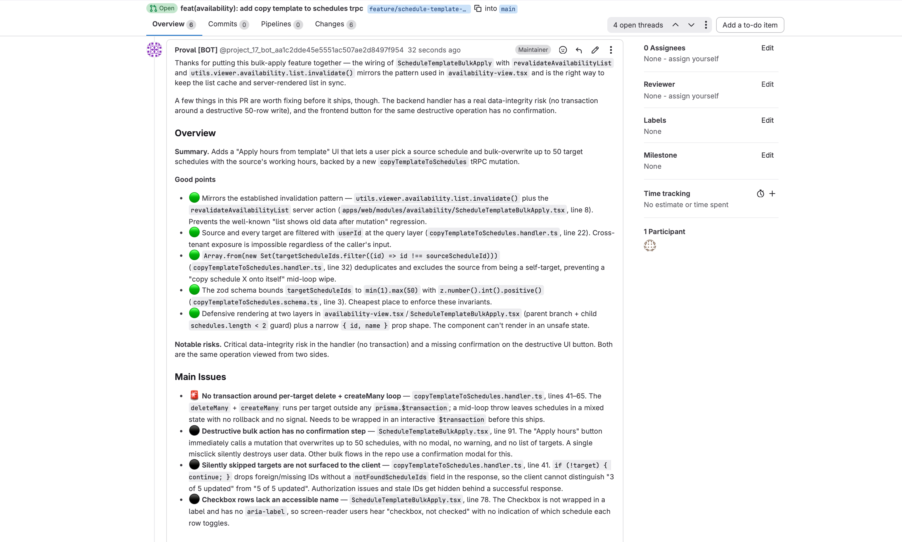
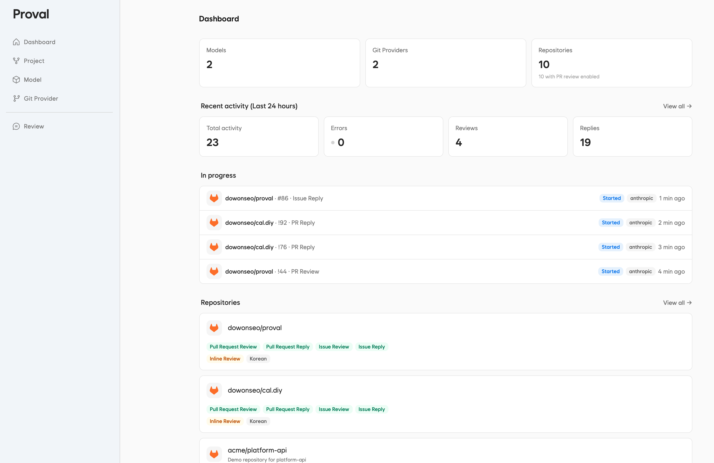

# Proval

A Self-hosted LLM code review agent. Connect it to your Git host, bring your own model, and let it review pull requests and issues on your own infrastructure.

[Visit the website](https://proval.dev)
[Try the demo](https://demo.proval.dev)
[Read the docs](https://docs.proval.dev)





- **Easy deploy**
  Proval takes 3 min, less than 10 lines to deploy to your server

- **Bring your own LLM (Even local models)**
  Proval works with OpenAI-compatible Chat Completions APIs, so you can use OpenAI, local model APIs like Ollama and llama.cpp, or any internal LLM gateway. Anthropic and Gemini support are planned as first-class integrations.

- **GitLab, Forgejo, and GitHub support**
  Proval supports GitLab, Forgejo, and GitHub. Gitea and Codeberg are also a natural fit through Forgejo-compatible APIs.

- **Run it on your own network**
  Use Proval inside an internal network, homelab, or privacy-focused environment without depending on an external review SaaS.

## Features

- **Pull request review**
  When a new pull request opens, Proval reads the diff, groups changed files into review units, runs specialist sub-agents to investigate each group, and writes a consolidated review with findings grouped by severity. Each sub-agent explores the codebase on its own, so it can catch cross-file issues and hidden dependencies.

- **Issue replies**
  Works on issues too. Proval leaves a comment when one opens, and can reply when someone comments back. You can set it to respond to every message or only when @mentioned.

- **Inline comments**
  Findings are posted directly on the affected lines of code. Proval handles single-line and multi-line positions for GitHub, GitLab, and Forgejo.

- **Threaded replies**
  When someone replies to a Proval comment, it reads the thread context and responds. You can set it to reply only when mentioned or reply to every comment.

- **Activity tracking**
  Every review, reply, and issue comment is logged with token usage so you can track model costs.



## Quick start

The easiest way to try Proval is to run it with Docker Compose

### Docker Compose (Recommended)

```yaml
services:
    proval:
        image: ghcr.io/seoes/proval:latest
        ports:
            - "7900:7900"
            - "7901:7901"
        volumes:
            - ./data:/data
        environment:
            - ENCRYPTION_KEY=[Encryption Key]
```

ENCRYPTION_KEY is a random string generated by `openssl rand -base64 32`.

```bash
openssl rand -base64 32
```

### Docker

```bash
docker run -d \
  --name proval \
  -p 7900:7900 \
  -p 7901:7901 \
  -v proval-data:/data \
  -e DB_FILE_NAME=/data/app.db \
  -e ENCRYPTION_KEY=[Encryption Key] \  # openssl rand -base64 32
  ghcr.io/seoes/proval:latest
```

## How it works

```text
Webhook event
  -> Repository settings
  -> Git provider API
  -> LLM agent with code review tools
  -> Review comments or replies

Pull request review
  -> Planning agent (group changed files)
  -> Specialist sub-agents (parallel)
  -> Writing agent (summary + inline comments)
  -> Git provider comments
```

## Built with

- Bun
- Hono
- Sveltekit
- SQLite

## Development

```bash
git clone git@github.com:seoes/proval.git
cd proval
bun install
cp .env.example .env
# fill in your env vars
bun dev
```

## Note

I looked for a self-hosted code review agent that works with GitLab or Forgejo and found almost nothing. Most review tools are SaaS, they lock you into their model, and they send your code to someone elses server. I run my home lab with local LLMs and wanted something that keeps everything on my network. So I built Proval.

Proval is still early. There are rough edges, missing features, and things that will break. I am actively developing it and feedback is the most useful thing you can give. Open an issue, start a discussion, or send a pull request.

I believe the local LLM market is growing. Models keep getting better at code review, and running them on your own hardware keeps costs predictable and data private.

## Planned Features

- Custom User Prompt
- Authentication and authorization
- SSO support
- LLM Provider integration based on OAuth subscriptions
- Enhance review quality
    - Reduce False Positives
    - Focus on critical issues only
- Rate limit
- Only respond to certain users
- Benchmark by models

<!-- ## LICENSE -->
