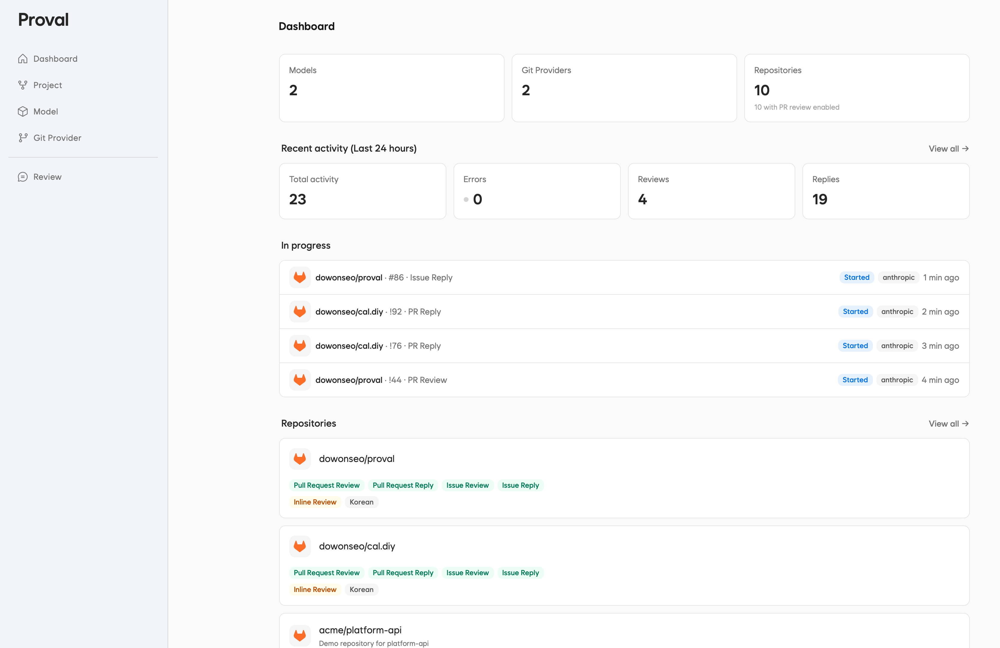

# Proval

A Self-hosted LLM code review agent. Connect it to your Git host, bring your own model, and let it review pull requests and issues on your own infrastructure.

[Website](https://proval.app) | [Demo](https://demo.proval.app) | [Docs](https://proval.app/docs)

https://github.com/user-attachments/assets/5afc0bba-d89e-43cd-b4d7-d5e7b022eeb1

- **Easy deploy**
  Proval takes 3 min, less than 10 lines to deploy to your server

- **Bring your own LLM (Even local models)**
  Proval works with OpenAI-compatible Chat Completions APIs, so you can use OpenAI, local model APIs like Ollama and llama.cpp, or any internal LLM gateway. Anthropic and Gemini support are planned as first-class integrations.

- **GitLab, Forgejo, and GitHub support**
  Proval supports GitLab, Forgejo, and GitHub. Gitea and Codeberg are also a natural fit through Forgejo-compatible APIs.

- **Run it on your own network**
  Use Proval inside an internal network, homelab, or privacy-focused environment without depending on an external review SaaS.

## Features

- **Pull request review**
  When a pull request gets a meaningful push (or a draft becomes ready), Proval reads the diff, groups changed files into review units, runs specialist sub-agents to investigate each group, and writes a consolidated review with findings grouped by severity. Each sub-agent explores the codebase on its own, so it can catch cross-file issues and hidden dependencies. Repository settings choose off, first push only, or every push.

- **Issue replies**
  Works on issues too. Proval leaves a comment when one opens, and can reply when someone comments back. You can set it to respond to every message or only when @mentioned.

- **Inline comments**
  Findings are posted directly on the affected lines of code. Proval handles single-line and multi-line positions for GitHub, GitLab, and Forgejo.

- **Threaded replies**
  When someone replies to a Proval comment, it reads the thread context and responds. You can set it to reply only when mentioned or reply to every comment.

- **Activity tracking**
  Every review, reply, and issue comment is logged with token usage so you can track model costs.



## Quick start

The easiest way to try Proval is to run it with Docker Compose

### Docker Compose (Recommended)

```yaml
services:
    proval:
        image: ghcr.io/seoes/proval:latest
        ports:
            - "7900:7900"
            - "7901:7901"
        volumes:
            - ./data:/data
        environment:
            - ENCRYPTION_KEY=[Encryption Key]
```

ENCRYPTION_KEY is a random string generated by `openssl rand -base64 32`.

```bash
openssl rand -base64 32
```

LAN HTTP needs no extra setting. When the dashboard is served over HTTPS, set `COOKIE_SECURE=true` so the session cookie is marked Secure. See [Quick Start HTTPS](https://proval.app/docs/quick-start#https).

### Docker

```bash
docker run -d \
  --name proval \
  -p 7900:7900 \
  -p 7901:7901 \
  -v proval-data:/data \
  -e DB_FILE_NAME=/data/app.db \
  -e ENCRYPTION_KEY=[Encryption Key] \  # openssl rand -base64 32
  ghcr.io/seoes/proval:latest
```

When the dashboard is served over HTTPS, add `-e COOKIE_SECURE=true`.

### Kubernetes example

Keep one replica (SQLite on `/data`), use `Recreate`, and pin an image tag. Full notes: [Kubernetes example](https://proval.app/docs/kubernetes).

```yaml
apiVersion: v1
kind: Secret
metadata:
    name: proval
type: Opaque
stringData:
    encryption-key: "[Encryption Key]"
---
apiVersion: v1
kind: PersistentVolumeClaim
metadata:
    name: proval-data
spec:
    accessModes:
        - ReadWriteOnce
    resources:
        requests:
            storage: 10Gi
---
apiVersion: apps/v1
kind: Deployment
metadata:
    name: proval
spec:
    replicas: 1
    strategy:
        type: Recreate
    selector:
        matchLabels:
            app: proval
    template:
        metadata:
            labels:
                app: proval
        spec:
            containers:
                - name: proval
                  image: ghcr.io/seoes/proval:latest
                  ports:
                      - name: dashboard
                        containerPort: 7900
                      - name: webhook
                        containerPort: 7901
                  env:
                      - name: ENCRYPTION_KEY
                        valueFrom:
                            secretKeyRef:
                                name: proval
                                key: encryption-key
                      - name: DB_FILE_NAME
                        value: /data/app.db
                  volumeMounts:
                      - name: data
                        mountPath: /data
                  readinessProbe:
                      httpGet:
                          path: /api/health
                          port: 7900
                  livenessProbe:
                      httpGet:
                          path: /api/health
                          port: 7900
            volumes:
                - name: data
                  persistentVolumeClaim:
                      claimName: proval-data
---
apiVersion: v1
kind: Service
metadata:
    name: proval
spec:
    selector:
        app: proval
    ports:
        - name: dashboard
          port: 7900
          targetPort: dashboard
        - name: webhook
          port: 7901
          targetPort: webhook
```

## How it works

```text
Webhook event
  -> Repository settings
  -> Git provider API
  -> LLM agent with code review tools
  -> Review comments or replies

Pull request review
  -> Planning agent (group changed files)
  -> Specialist sub-agents (parallel)
  -> Writing agent (summary + inline comments)
  -> Git provider comments
```

## Built with

- Bun
- Hono
- Sveltekit
- SQLite

## Development

```bash
git clone git@github.com:seoes/proval.git
cd proval
bun install
cp .env.example .env
# fill in your env vars
bun dev
```

## Personal Note

I was looking for a self hosted code review using my own LLM but couldn't find one I liked. As a HomeLab user, I also found only few code review agents that worked with my personal GitLab. That's why I built this self hosted code review agent Proval

It's still early. There are rough edges, missing features. I am actively developing it and feedback is the most useful thing you can give. If you open an issue for feature request or bug report, it'll helps me and everyone else using Proval.

I believe everyone will get their own Local LLM someday. Models keep getting smarter, and they keep getting better at code review. Hardware is quite expensive now but someday it will get cheaper. Hope we can run personal LLMs with better performance, keep our data private and safe.

## Planned Features

- Custom User Prompt
- Authentication and authorization
- SSO support
- LLM Provider integration based on OAuth subscriptions
- Enhance review quality
    - Reduce False Positives
    - Focus on critical issues only
- Rate limit
- Only respond to certain users
- Benchmark by models

## License

Licensed under the [GNU Affero General Public License v3.0](LICENSE).
